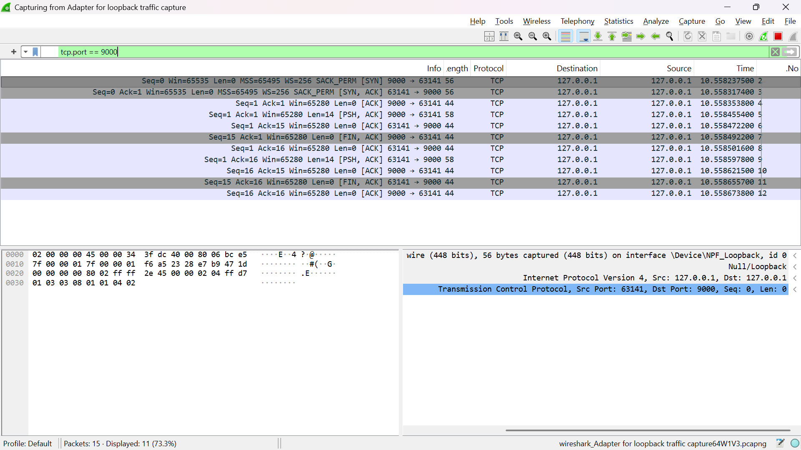
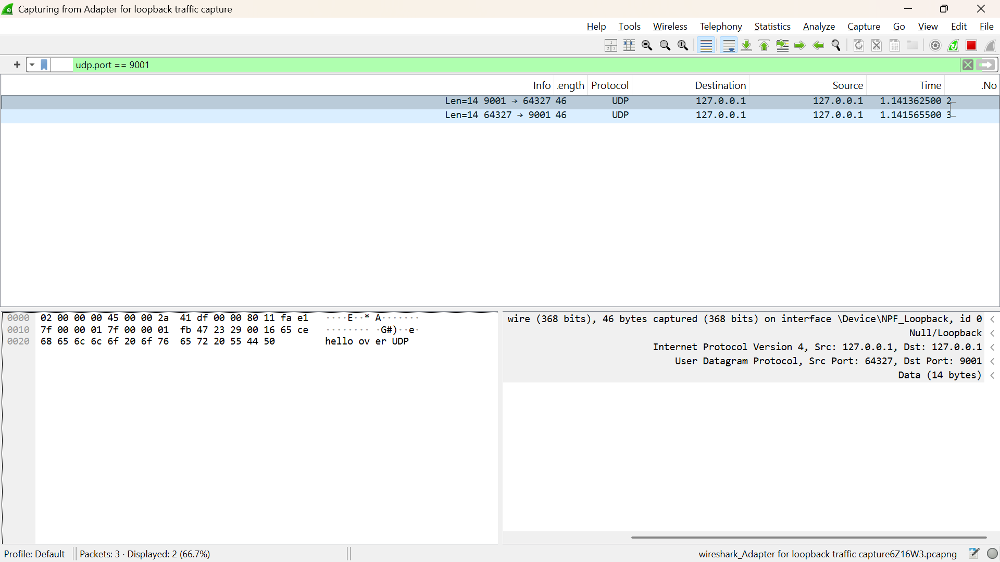

# Socket Echo + pytest

TCP and UDP echo servers in Python, with a pytest suite that verifies
their behavior and shows the practical differences between the two protocols.

Built as a learning project for network test automation.

## What's tested

| Area | What's verified |
|---|---|
| TCP echo | Data comes back unchanged: short, empty, larger than one read (10 KB), Hebrew UTF-8 |
| TCP lifecycle | Server handles consecutive clients; connection refused when nothing listens |
| UDP echo | Data comes back unchanged, including a 60 KB datagram |
| UDP boundaries | Two sends arrive as two separate messages |
| UDP limits | A datagram over 65,507 bytes is rejected |
| UDP no listener | No reply → timeout (Linux) or ConnectionResetError (Windows) |

**13 tests**, each server runs on a random free port, fresh per test (isolated, no port conflicts).

## How to run

Requires Python 3.10+.

```bash
python -m venv .venv
.venv\Scripts\activate          # Windows  (Linux/macOS: source .venv/bin/activate)
pip install -r requirements.txt
python -m pytest -v
```

Run the servers by hand:

```bash
python -m echo.tcp_server        # terminal 1 (port 9000)
python -m echo.tcp_client        # terminal 2
```

(Same for `udp_server` / `udp_client` on port 9001.)

## Project structure

```
echo/      TCP and UDP servers and clients (the code under test)
tests/     pytest suite; conftest.py holds the server fixtures
docs/      Wireshark captures
```

## What I learned: TCP vs UDP

**TCP is a stream.** TCP delivers a continuous stream of bytes with no message
boundaries. A single `recv()` returns whatever has arrived so far: part of a
message, all of it, or pieces of two messages. That's why the TCP client reads
in a loop until the server closes the connection (`recv()` returns empty bytes).

**UDP is message-based.** Each `sendto()` becomes one separate datagram, and each
`recvfrom()` returns exactly one complete datagram, never half of one and never
two merged together. So the UDP client only needs a single `recvfrom()`. It does
need a timeout, because UDP never reports that the other side is gone.

**Connections vs. no connections.** TCP is connection-oriented: the OS keeps
state for each client (sequence numbers, acknowledgments, retransmissions), so
`accept()` creates a dedicated socket per client. UDP is connectionless: every
datagram carries the sender's address, so one socket can receive from anyone
and reply with `sendto()` to that address.

**Why the boundaries test only works for UDP.** TCP guarantees that every byte
arrives, in order, but not where one message ends and the next begins. Sending
"one" then "two" over TCP might arrive as "onetwo", or as "on" + "etwo". A test
asserting on a single `recv()` would be flaky. UDP keeps each send separate, so
the test is reliable. Real TCP protocols solve this with framing, such as a
length prefix or a delimiter (HTTP uses `Content-Length`, for example).

| | TCP | UDP |
|---|---|---|
| Connection | Yes: handshake, per-client state | No |
| Data shape | Byte stream, no boundaries | Separate messages (datagrams) |
| Guarantees | All bytes arrive, in order | None: may be lost, duplicated or reordered |
| Reading | Loop until the connection closes | One `recvfrom()` = one message |

### TCP in Wireshark


The capture shows the three-way handshake (SYN, SYN-ACK, ACK) that opens the
connection, the data with ACKs confirming it arrived, and FIN packets from both
sides closing the connection.

### UDP in Wireshark


Only two packets: the request and the reply. There's no handshake, no ACKs and
no FIN, because UDP has no connection to open or close and doesn't confirm delivery.

## Design decisions

- **Port 0:** the OS picks a free port, so tests never collide with each other or other programs
- **Fixtures with `yield`:** each test gets a fresh server, and cleanup runs even if the test fails
- **Timeouts everywhere:** a network test should fail, not hang forever
- **Edge cases chosen on purpose:** empty input, data bigger than one read, non-ASCII bytes, and negative tests

## Next

This is the warm-up for a larger project: a pytest framework that validates
a virtual network (routers, BGP, VLANs, failover) built with containerlab.